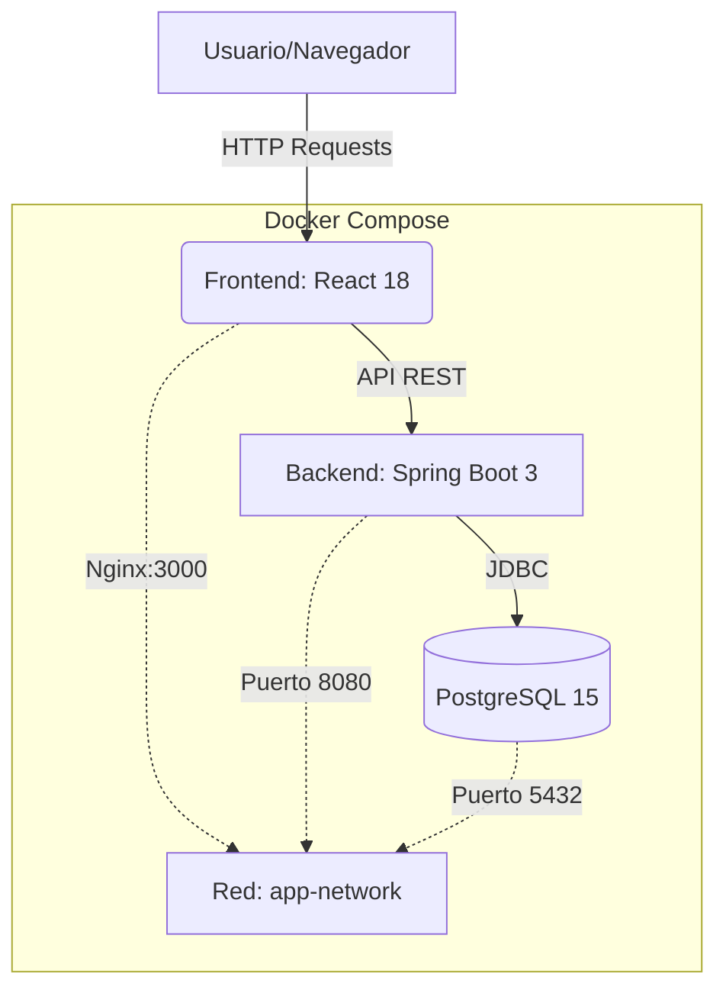

# Client-Management-App


## 📋 Visión general
Esta aplicación Client Management es una SPA que permite listar, crear, editar, eliminar y buscar clientes mediante una interfaz React y una API REST en Spring Boot, todo orquestado con Docker Compose. Ofrece:

### Tabla de clientes con operaciones CRUD y búsqueda


*Ejemplo de la interfaz de la aplicación*

### Formularios para agregar y actualizar clientes con validación


*Ejemplo de la interfaz de la aplicación*

### Base de datos PostgreSQL gestionada por Spring Data JPA


*Ejemplo de la interfaz de la aplicación*

---

## 🏗️ Arquitectura del Sistema



--- 

## 🛠 Tecnologías

### Frontend
- React 18
- React Router DOM
- Axios
- Create React App

### Backend
- Spring Boot 3
- Spring Data JPA
- Hibernate
- PostgreSQL

### Contenerización
- Docker (multi-stage: Node→Nginx / Gradle→JRE)
- Docker Compose

### Tests
- JUnit 5
- Mockito
- Embedded PostgreSQL para pruebas

--- 
## 📁 Estructura del proyecto

```bash
Client-Management-App/
├─ Client_Managment_Backend/      # Spring Boot backend  
│  ├─ src/main/java/com/...  
│  ├─ application.properties  
│  ├─ Dockerfile                  
│  └─ .dockerignore  
├─ client_managment_frontend/     # React + Nginx frontend  
│  ├─ public/  
│  ├─ src/                        # components/, pages/, services/  
│  ├─ .env                        
│  ├─ Dockerfile                  
│  └─ nginx.conf                  
└─ docker-compose.yml             
```

---

## 🚪 Endpoints de la API

| **Método** | **Ruta** | **Descripción** |
| `GET` | /api/clients | Listar todos los clientes |
| `GET` | /api/client/{id} | Obtener cliente por ID |
| `GET` | /api/client/{name} | Obtener cliente por nombre |
| `POST` | /api/add | Crear nuevo cliente |
| `PUT` | /api/update/{id} | Actualizar cliente |
| `DELETE` | /api/delete/{id} | Eliminar cliente |
